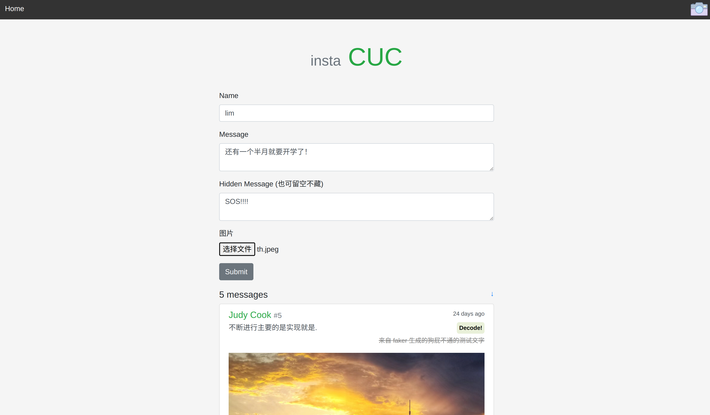
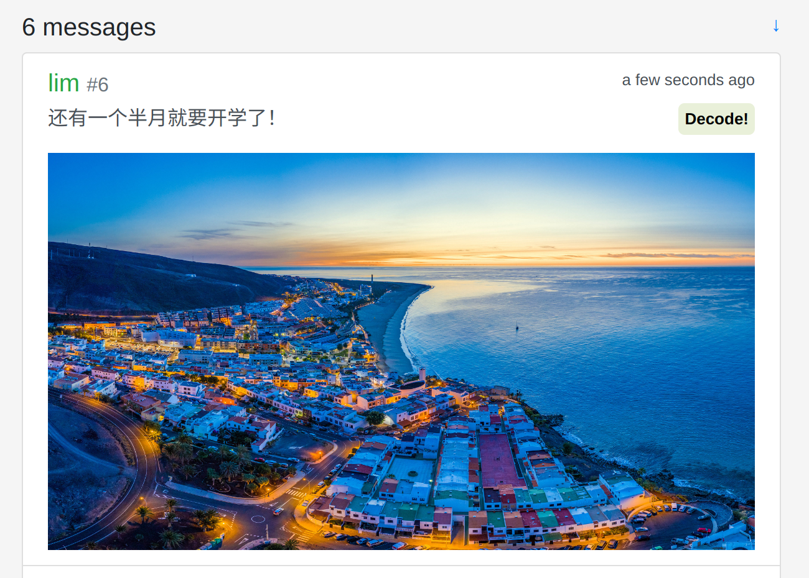
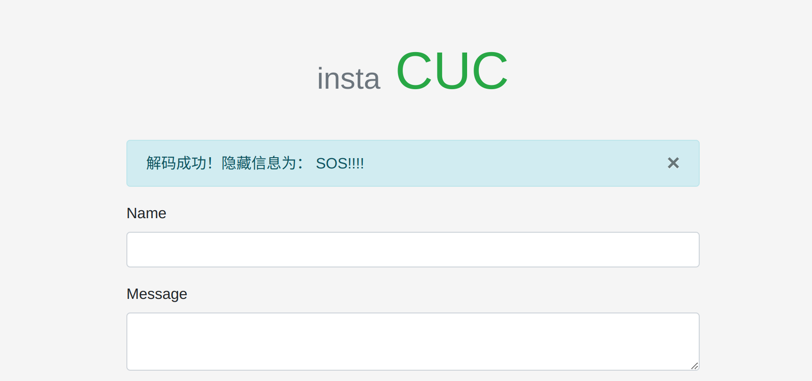

# InstaCUC

## 简介

~~本项目是从各开源项目和教程中东拼西凑再魔改出来的 NTR 作品~~

### 特色

- 基于 `Flask` 框架
- `unittest` 单元测试
- `Github Actions` 自动化测试，`CI 持续集成` 集成开发
- `coverage` 测试代码覆盖率统计
- 在 `virtualenv` 和 `Pipenv` 两种包管理环境下均进行 `unittest` 测试
- 用户友好的错误提示
- 使用 `Flask-Bootstrap` 和 `Flask-WTF` 简化前端开发
- 使用 `WTForm` 实现抵抗 `CSRF` 攻击
- `web 前端` 集成一键进行图片隐写信息提取按钮，后端返回提取后的信息
- `数据库` 中不保存隐写信息 `字符串`，仅保存该图片是否含有隐写信息的标志位。在需要隐写信息时再从图片中提取

## Installation

clone:

```bash
$ git clone https://github.com/Mr-Nobodyl/InstaCUC.git
$ cd InstaCUC
```

### virtualenv 安装:

```bash
$ python -m venv env
$ source env/bin/activate  # use `env\Scripts\activate` on Windows
$ pip install -r requirements.txt
```

### Pipenv 安装:

```bash
$ pipenv install
$ pipenv shell
```

生成测试数据:

```bash
$ flask forge
```

```bash
$ flask run
* Running on http://127.0.0.1:5000/
```

### 使用示例

- 添加消息



- 对于 _含有有隐写信息_ 的图片，点击 `Decode!` 按钮将会在后端进行解码，并将解码后的信息显示在页面上



- 得到解码后的信息



## 参考

- [Flask Web 开发实战](https://helloflask.com/book/1/)
- [SayHello](https://github.com/greyli/sayhello)
- [Quickstart Flask Documentation (2.3.x)](https://flask.palletsprojects.com/en/2.3.x/quickstart/)
- [Tutorial Flask Documentation (2.3.x)](https://flask.palletsprojects.com/en/2.3.x/tutorial/)
- [Dropzone.js](https://www.dropzone.dev/)
- [How To Install Nginx on Ubuntu 22.04](https://www.digitalocean.com/community/tutorials/how-to-install-nginx-on-ubuntu-22-04#server-logs)
- [Flask（9）- 蓝图的基本使用](https://www.cnblogs.com/poloyy/p/15004389.html)
- [Flask 入门教程](https://read.helloflask.com/)
- [How to use Flask-Session in Python Flask ?](https://www.geeksforgeeks.org/how-to-use-flask-session-in-python-flask/)
- [如何处理请求](https://dormousehole.readthedocs.io/en/latest/lifecycle.html#id5)
- [【Flask】 结合 wtforms 的文件上传表单](https://www.cnblogs.com/franknihao/p/7422805.html)
- [How to send image with form data in test case with unittest in flask application?](https://stackoverflow.com/questions/34331137/how-to-send-image-with-form-data-in-test-case-with-unittest-in-flask-application)
- [Do I have to do StringIO.close()?](https://stackoverflow.com/questions/9718950/do-i-have-to-do-stringio-close)

## License

This project is licensed under the MIT License (see the
[LICENSE](LICENSE) file for details).
